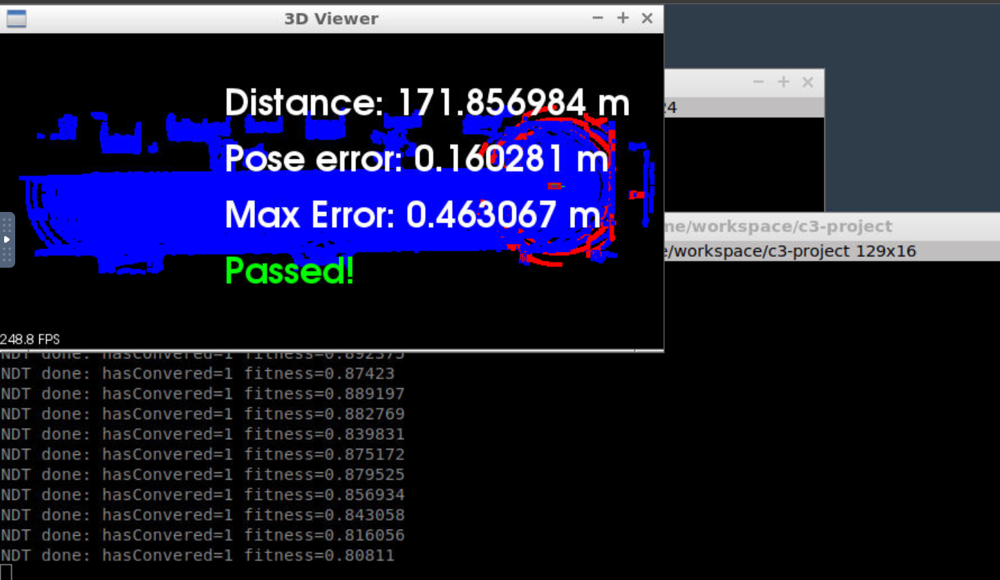
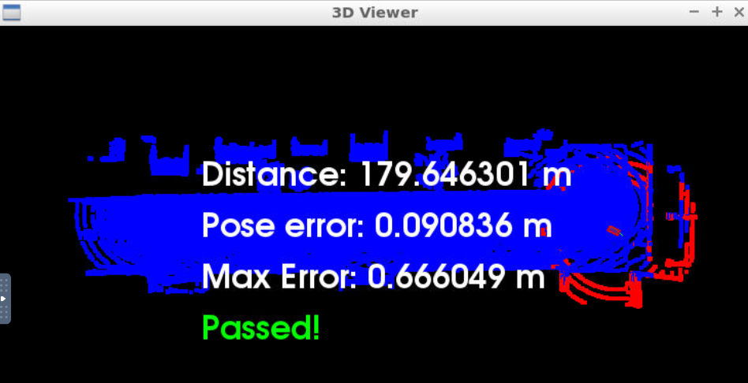

# Udacity Self Driving Car Engineer C3 Localization 

- Goal: localize a car driving in simulation for at least 170m from the starting position and never exceeding a distance pose error of 1.2m. The simulation car is equipped with a lidar, provided by the simulator at regular intervals are lidar scans. There is also a point cloud map map.pcd already available, and by using point registration matching between the map and scans localization for the car can be accomplished. This point cloud map has been extracted from the CARLA simulator.

# Building and running in the virtual workspace

1. Compile the code (Terminal Tab 1)

	cd /home/workspace/c3-project
	cmake .
	make
    
(*Once 1 is done, usually running make alone is enough (unless adding files to CMakeLists.txt)*)

2. Launch the simulator in a new terminal tab (Terminal Tab 2)

	su - student
	cd /home/workspace
	./run-carla.sh

3. Run the project code back in the first tab (Terminal Tab 1)

	cd /home/workspace/
	./cloud_loc
    
    
# References
    
- [PCL docs](https://pointclouds.org/documentation/)

# Solution notes

- NDT was chosen as it seemed to have a bit better performance. One could have combined NDT for the first steps and then ICP for later refinement, but NDT alone was already enough.
- Key to final working approach seemed to mostly need a low number of iterations, in the end only 3, while variosu sources usually recommend around 30, so being fast enough seemed most important.
- Also increased lower_fov to focus less on floor but more on the structures above ground for localization and to save on points.
- First though resolutions of filtering and NDT should be the same, but it seemed to perform better with the voxel grid filter at 0.5 while NDT resolution was at 1.0
- To help the initial pose the difference from the previous to the current position was added to the current position (= kind of most simple assuming constant speed from the last step, even if speed changes it will change gradually)

With the last settings, even going forward with 4 taps forward and also steering a bit around was fine:

